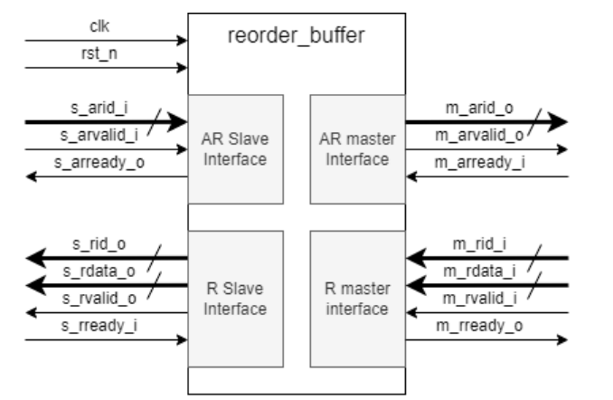
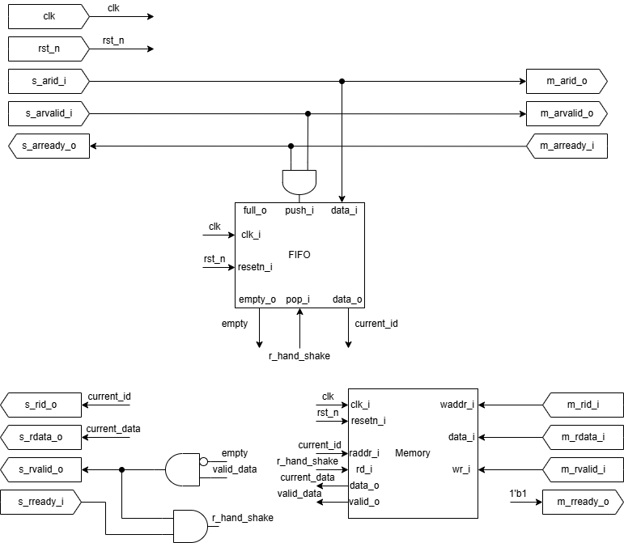
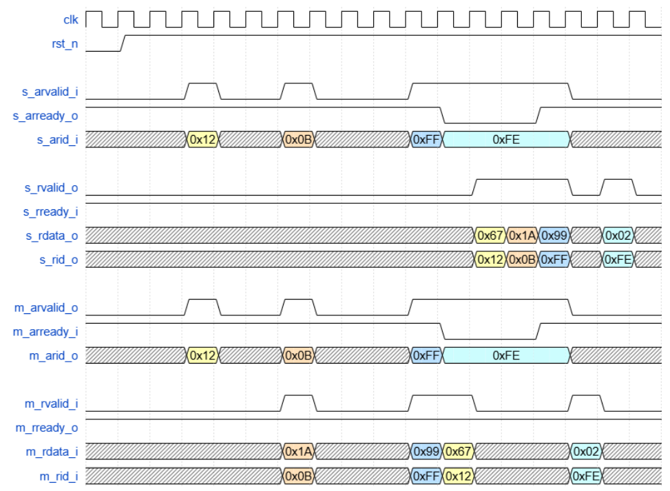

# Потоковый реордер-буфер


Модуль выполняет следующие функции:
+ Принимает поток из 16 уникальных ID в диапазоне от 0 до 15 через AR slave интерфейс. Порядок ID в потоке может быть произвольным.
+ Передаёт поток ID без изменений в том же порядке из AR slave интерфейса в AR master интерфейс.
+ Для каждого переданного ID на AR master интерфейсе принимает данные через R master интерфейс. Каждое слово данных также помечено ID, но порядок приёма данных на R master интерфейсе может не совпадать с порядком передачи ID на AR master интерфейсе.
+ Выдает данные на R slave интерфейс, переупорядочивая их таким образом, чтобы ID потока данных соответствовали порядку ID из потока ID на AR slave интерфейсе.

Ниже представлена микроархитектура reorder_buffer\


Ниже представлена пример времянки для четырёх ID\


## Работа модуля
Интерфейс модуля
```verilog
module reorder_buffer #(
  parameter DATA_WIDTH = 8
)(
  input  logic                  clk,
  input  logic                  rst_n,
  //AR slave interface
  input  logic [3:0]            s_arid_i,
  input  logic                  s_arvalid_i,
  output logic                  s_arready_o,
  //R slave interface
  output logic [DATA_WIDTH-1:0] s_rdata_o,
  output logic [3:0]            s_rid_o,
  output logic                  s_rvalid_o,
  input  logic                  s_rready_i,
  //AR master interface
  output logic [3:0]            m_arid_o,
  output logic                  m_arvalid_o,
  input  logic                  m_arready_i,
  //R master interface
  input  logic [DATA_WIDTH-1:0] m_rdata_i,
  input  logic [3:0]            m_rid_i,
  input  logic                  m_rvalid_i,
  output logic                  m_rready_o
);
```

Так как нужно переупорядочивать данные в канале R, то для решения нужно FIFO, который будет сохранять порядок транзакций, и Memory, который сохраняет данные перед упорядочиванием.

FIFO нужен для записи порядка транзакций.\
Так как принимаются только 16 уникальных ID в диапазоне от 0 до 15, было решено сделать FIFO шириной слов 4 бита и глубиной 16 слов.\
Также выводятся состояния empty и full.

Memory нужен для приёма и записи полученных данных от Slave.\
Так как принимаются только 16 уникальных ID в диапазоне от 0 до 15, было решено в качестве адреса использовать ID.\
При записи также ставиться соответствующий ID бит валидности, а при чтении убирается.

Алгоритм модуля:
1. Если FIFO обнаруживает handshake в канале AR, происходит запись ID в очередь.
2. Если Memory обнаруживает handshake в канале R master, записывает данные по адресу ID выставляет соответствующий valid в 1'b1.
3. Если FIFO не пустое, а данные в Memory по адресу ID из FIFO валидные, то выставляется s_rvalid_o 1'b1.
4. Если происходит handshake в канале R slave, то в Memory опускается валидность, а в FIFO делается pop.

## Тестовые вектора
1. tv_example.txt - пример из задания.
2. tv_full_id_straight.txt - все 16 id и получение данных в прямом последовательности.
3. tv_full_id_back.txt - все 16 id и получение данных в обратном последовательности.
